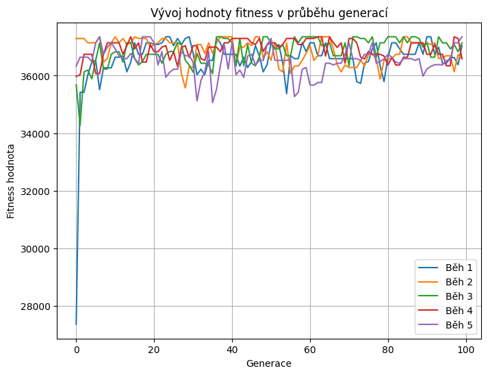

# Optimalizace výběru položek do omezeného prostoru pomocí genetického algoritmu (knapsack problem)

**Semestrální úkol předmětu VI1**  
**Autor:** Bc. Adéla Leppeltová  
**Fakulta informatiky a managementu, Univerzita Hradec Králové**  
**Akademický rok: 2024/25**  

Tento projekt implementuje genetický algoritmus pro řešení klasického **batohového problému** (knapsack problem).  
Cílem je nalézt takovou kombinaci položek, která nepřekročí maximální povolenou hmotnost batohu, zároveň maximalizuje celkovou hodnotu a využije dostupný prostor co nejefektivněji.

Projekt se nachází v Jupyter notebooku s názvem [genetic_knapsack_solver.ipynb](genetic_knapsack_solver.ipynb).

- Reprezentace jedince: binární vektor, např. [1, 0, 1, 1, 0]
- Fitness funkce: zohledňuje hodnotu a počet položek, penalizuje překročení hmotnosti.
- Operace: selekce, křížení, mutace s nízkou pravděpodobností.

## Parametry algoritmu

| Parametr          | Použitá hodnota |
| ----------------- | --------------- |
| Max. hmotnost     | 8.0             |
| Velikost populace | 50              |
| Počet generací    | 100             |
| Míra mutace       | 0.05            |

## Výstup

- Nejlepší nalezené řešení
- Seznam vybraných položek, jejich váha a hodnota
- Celková hmotnost, hodnota a počet položek
- Binární reprezentace výsledku

## Vizualizace výstupu

Graf zobrazuje vývoj pěti běhů algoritmu.

osa X = číslo generace  
osa Y = hodnota fitness v dané generaci

